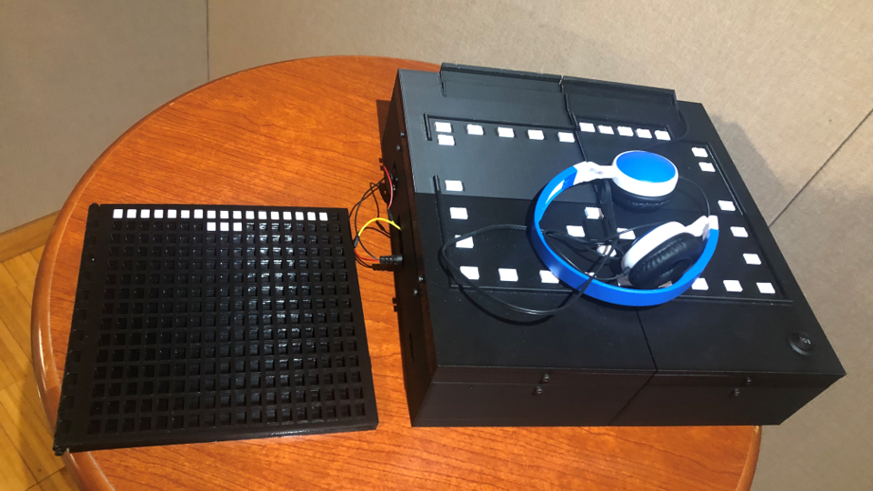
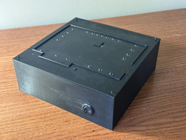
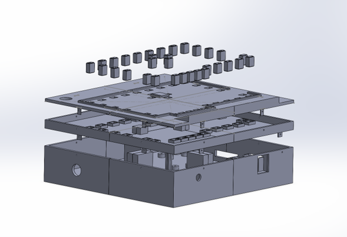
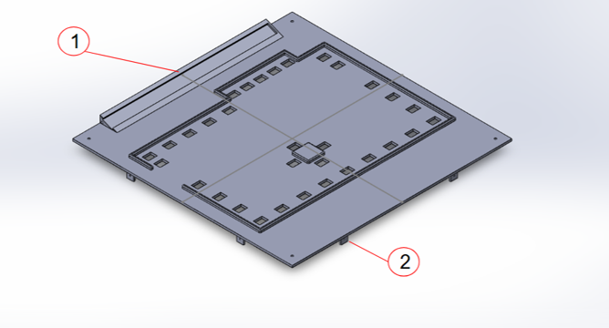
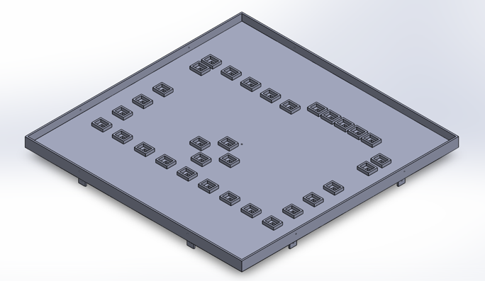
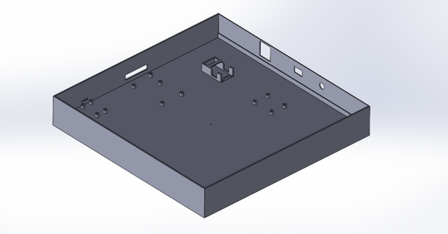
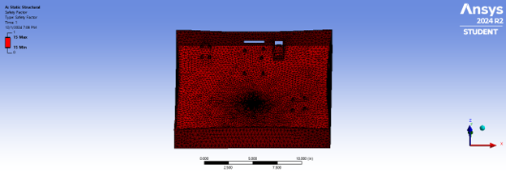
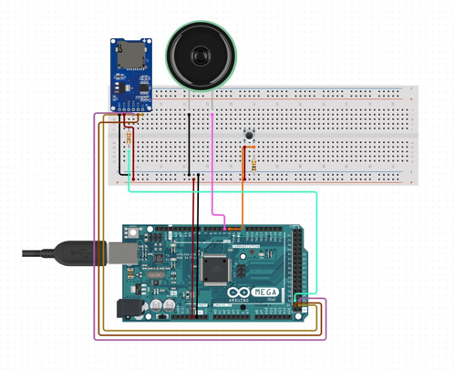

<div align="center">

# Audio-Tactile Map for the Gannett Art Gallery

\

### A modular, 3D-printed assistive device that lets visually impaired visitors explore art galleries through touch and spatial audio.

[](#)
[](#)
[](#)
[](#)

</div>

---

## At a Glance

| | |
|:---|:---|
| **What it does** | 32 tactile Braille buttons trigger location-aware audio descriptions of gallery artworks |
| **Who it's for** | Blind and visually impaired museum visitors |
| **Where it's deployed** | [Gannett Art Gallery](https://gannettgallery.org), SUNY Polytechnic Institute |
| **Validated by** | Central Association for Blind and Visually Impaired (CABVI) |
| **Built with** | Arduino MEGA, 3D-printed PLA, TMRpcm audio engine |
| **Cost to build** | ~$170 USD |

<div align="center">

\
**Original Prototype**

</div>

## How It Works

```
┌─────────────┐     ┌─────────────┐     ┌─────────────────┐
│   TOUCH     │────▶│    MAP      │────▶│     HEAR        │
│             │     │             │     │                 │
│ Press a     │     │ Arduino     │     │ Pre-recorded    │
│ Braille     │     │ reads the   │     │ audio plays     │
│ button on   │     │ button pin  │     │ through speaker │
│ the gallery │     │ and pulls   │     │ or headphones   │
│ layout      │     │ .wav from   │     │                 │
│             │     │ SD card     │     │                 │
└─────────────┘     └─────────────┘     └─────────────────┘
```

---

## Why This Exists

Museums are visual by default. Existing accessibility tools often:
- **Require a smartphone** — creating cost and usability barriers  
- **Flood users with audio** — disrupting spatial memory formation  
- **Offer no tactile reference** — making cognitive mapping impossible  

The ATM is a **standalone, haptic-first** device. Visitors feel the gallery layout in Braille, press a button, and hear a description — no apps, no connectivity, no friction.

> *Developed in continuous consultation with CABVI to ensure real-world usability.*

---

## Real-World Impact

> *"The modular Braille blocks and clear audio quality make independent navigation possible. Moving the speaker to the front and adding adjustable audio speed would make this even stronger."*  
> **— CABVI Evaluation Feedback, April 25, 2025**

**Deployed and tested live** at the Gannett Gallery alongside a refreshable Braille tablet companion. The device is currently in active use for rotating exhibitions.

---

## Architecture

A **three-layer modular stack** — each layer splits into 4 quadrants to fit standard 220×220 mm FDM printers.

<div align="center">

\
**Exploded View of the CAD model**

</div>

| Layer | Function | Key Features |
|-------|----------|--------------|
| **Top** | Tactile interface | Gallery contour map, 32 removable Braille blocks, interchangeable title plate |
| **Middle** | Button support | 32 momentary switches, blanking plates for unused slots, M3 alignment tabs |
| **Bottom** | Electronics chassis | Arduino MEGA, SD reader, LM386 amp, speaker/headphone jack, battery, structural pillars |

**Materials:** PLA (structural), steel M3 fasteners  
**Dimensions:** 12" × 12" × 3.5"  
**Audio format:** 8-bit PCM, 16 kHz mono `.wav`

<div align="center">

\
**Top Plate**\
\
**Middle Plate**\
\
**Bottom Plate**

</div>

## Engineering Highlights

<details>
<summary><b>🛠️ Mechanical — Safety Factor 15</b></summary>

The bottom load-bearing plate was analyzed in **ANSYS APDL & Workbench** under full distributed load:

| Metric | Value |
|--------|-------|
| Max deflection (center) | 1.17×10⁻⁴ in |
| Bending stress (center) | 0.504 psi |
| Von Mises stress | 0.589 psi |
| **Safety factor** | **15** |

Destructive testing on an **Instron 33R4206** confirmed:
- **Tensile:** >9,900 lbf before failure
- **Compressive:** Deformation initiated at **2,500 lbf**

> The ATM withstands **>1,000×** its operational load.

<div align="center">

\
**Ansys Factor of Safety**\
\
**Von Mises Stress**\

</div>

</details>

<details>
<summary><b>⚡ Electrical — 32-Button Direct-Mapped Input</b></summary>

All 32 buttons wire directly to Arduino digital pins in `INPUT_PULLUP` mode. A centralized solderable breadboard acts as a ground bus — eliminating 32 individual ground wires and cutting assembly time by ~40%.

**Audio chain:** Arduino PWM (D11) → 3-position toggle → LM386 amplifier → speaker or 3.5mm TRS jack.

<div align="center">

\
**Setup of the electrical system**\


</div>

</details>

<details>
<summary><b>💾 Firmware — TMRpcm Audio Engine</b></summary>

```cpp
#include "SD.h"
#include "TMRpcm.h"

#define SD_CS 53
TMRpcm tmrpcm;

void setup() {
  tmrpcm.speakerPin = 11;
  SD.begin(SD_CS);
  tmrpcm.setVolume(5);
  // 32 pins configured as INPUT_PULLUP...
}

void loop() {
  if (digitalRead(BUTTON_PIN2) == LOW) {
    tmrpcm.pause();
    tmrpcm.play("a.wav");   // Gallery position 'a'
  }
  // ... 31 additional slots
}
```

- **Non-blocking:** `pause()` prevents audio overlap
- **Low latency:** <50 ms from press to playback
- **Hot-swappable:** Update audio by swapping the SD card

</details>

<details>
<summary><b>🎵 Audio Pipeline</b></summary>

All tracks converted to TMRpcm-compatible PCM:

```bash
ffmpeg -i input.mp3 -ar 16000 -ac 1 -c:a pcm_u8 output.wav
```

| Parameter | Requirement |
|-----------|-------------|
| Bit depth | 8-bit unsigned |
| Sample rate | 16,000 Hz |
| Channels | Mono |
| Format | `.wav` |

Files are named `a.wav` through `ff.wav`, mapped clockwise to Braille block positions.

</details>

---

## Build It

### Bill of Materials

| Category | Part | Qty | ~Cost |
|----------|------|-----|-------|
| Brain | Arduino MEGA 2560 | 1 | $48 |
| Storage | Micro SD Card Reader (SPI) | 1 | $7 |
| Audio | LM386 Amplifier Module | 1 | $3.50 |
| Audio | 3.5mm TRS Breakout + Toggle Switch | 1 | $19 |
| Audio | 8Ω Speaker | 1 | $10 |
| Input | Tactile Push Buttons (12×12 mm) | 32 | $8 |
| Power | Solderable Breadboard + wiring | 1 | $8 |
| Structure | PLA Filament (Black, ~2 kg) | 2 | $42 |
| Structure | PLA Filament (White, Braille) | 1 | $21 |
| Hardware | M3×8 mm Socket Head Bolts | 50 | $5 |
| | | **Total** | **~$170** |

### Repository Structure

```
├── firmware/
│   └── atm_firmware.ino          # Arduino sketch
├── cad/
│   ├── top_layer/                # SolidWorks parts + STL
│   ├── middle_layer/
│   └── bottom_layer/
├── audio/
│   └── convert.sh                # ffmpeg batch script
├── docs/
│   ├── TECHNICAL.md              # Full capstone report content
│   └── images/                   # Photo assets (TODO)
└── README.md                     # You are here
```

### Assembly (TL;DR)

1. **Print** 12 quadrant parts (4 per layer) on an Ender 3 S1 Pro or equivalent
2. **Wire** buttons to a shared ground bus, route signals to Arduino D2–D45
3. **Connect** SD reader (SPI), LM386 amp (D11), and power switch
4. **Assemble** layers with M3 bolts, insert Braille blocks, load SD card
5. **Test** each button for <1 lb actuation force and clean audio playback

---


## Team

| | |
|:---|:---|
| **Bao Do** | Electrical architecture, firmware, wiring, integration, testing |
| **Edric Pham** | Top & middle layer CAD, Braille block design, drafting |
| **Cong Du Phan** | Bottom layer CAD, ANSYS FEA, structural validation |
| **Advisor** | Dr. D.K. Jones |
| **Partner** | [CABVI](https://www.cabvi.org) — User testing & design consultation |

---

## Acknowledgments

- **SUNY Academic Innovation Grants Program** — Funding
- **SUNY Poly CGAM** — 3D printing resources
- **CCAVA Initiative** — Project framework and accessibility mission

---

<div align="center">

**[⬆ Back to Top](#audio-tactile-map-for-the-gannett-art-gallery)**

*Built for accessibility. Open to collaboration.*

</div>
